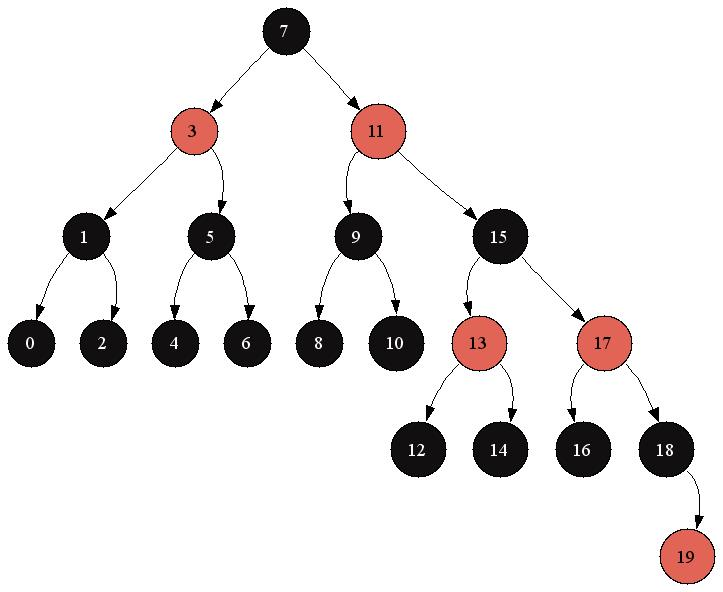

# Red black tree

### Using

>You can run project with two commands
>
>- make run : will run RBmain.cpp.
>- make test : will run test and print time compared with std::set. 
>- You can set your size if test - "make test size=10000000" (standard size = 1 000 000)
>
>To use this tree in your own project include "RBtree.h" and in makefile link "RBtree.o"

### Functions

>```c++
>void  Construct(RBtree* tree);
>void  Construct(RBtree* tree, int (*cmp)(const void*, const void*));
>```
>
>Constructors : you should call it before using another functions
>
>First one use IntCmp - default int comparator
>
>If your type isn't int, use second constructor with comparator for your type
>
>```c++
>void  Destruct(RBtree* tree);
>```
>
>Call this function when you will finish work with tree
>
>```c++
>void  Insert(RBtree* tree, ElemT key);
>void  Delete(RBtree* tree, ElemT key);
>```
>
>Inserting element (if this element already exists nothing will happen)
>
>Deleting element (if this element doesn't exist nothing will happen)
>
>```c++
>void  TreeDump(RBtree* tree);
>```
>
>If you have dot installed on your PC, you can call this function to see how tree looks like
>
>example :
>
> 
>
>```c++
>Node* NodeNext(RBtree* tree, Node* node);
>Node* NodePrev(RBtree* tree, Node* node);
>```
>
>just upper bound and lower bound for Node*
>
>```c++
>Node* FindNode     (RBtree* tree, ElemT key);
>```
>
>Returns node with this key and nil if node with this key doesn't exist
>
>```c++
>bool  Find         (RBtree* tree, ElemT key);
>```
>
>Return true if node with this key exists and else false
>
>```c++
>ElemT KthStatistics(RBtree* tree, Node* node, size_t k);
>```
>
>Returns element in kth place in sorted array of all elements
>
>```c++
>Node* UpperBound   (RBtree* tree, ElemT key);
>Node* LowerBound   (RBtree* tree, ElemT key);
>```
>
>All world know what is it (strict comparison)
>
>to get key just use this function like :
>
>```c++
>UpperBound(&tree, 5)->key
>```
>
>```c++
>Node* TreeMin      (RBtree* tree, Node* node);
>Node* TreeMax      (RBtree* tree, Node* node);
>```
>
>Returns node with min/max value in subtree of node
>
>```c++
>int   IntCmp       (const void* elem1, const void* elem2);
>```
>
>Example of comparator
>
>Uses as default

